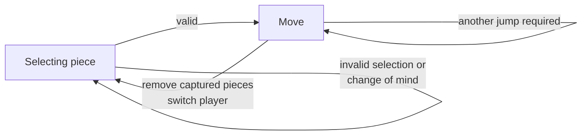

# Checkers

Use `launcher.py` and Python 3.10+ (Numpy, and for web UI also FastAPI, uvicorn, pydantic: in your browser go to http://127.0.0.1:8000).

## Summary

Game of Checkers extends my use of MVC OOP design pattern to:
- Web UI (using FastAPI) vs previously used Excel/CLI
- 2 player game (not online multiplayer) vs. a single-player or bot [(see my Minesweeper)](https://github.com/and47/xlminespy).

### Web UI
The web UI leverages JavaScript to provide a dynamic and interactive experience. The FastAPI server (running as a daemon thread) serves the frontend files and handles the backend logic.

### Model

Implemented in multiple classes (see compared to 1st commit) and is designed to be independent of the UI, making it easy to extend and test.
This separation of concerns allows for extensions such as adding game logging, replay, save/load functionality and support of e.g. International or American draughts rules.

#### Board Class
Manages the the game board, location of pieces, basic navigation.

#### GameRound Class
The GameRound class manages the flow of the game. It handles turn-taking, game state transitions (implemented using ABC + dataclasses), and integrates with the Board class. 

## Second commit: Exemplified refactoring

Highly stateful Board class violated SRP. Used state design pattern to split responsibilities (piece/destination selection, continuation of the move by player implementing GameState interfacee) and make it easier to extend with new rules/functionalities (e.g. changing sides, creating game from existing setup/situation, and in future: undo action, history recording). Context (GameRound) controlling the state and also serving as Mediator between rest of the model Model and View.

## To-do:
Add RL to train bot strategy. For American ruleset the game is solved: there exists an optimal (draw) strategy.
